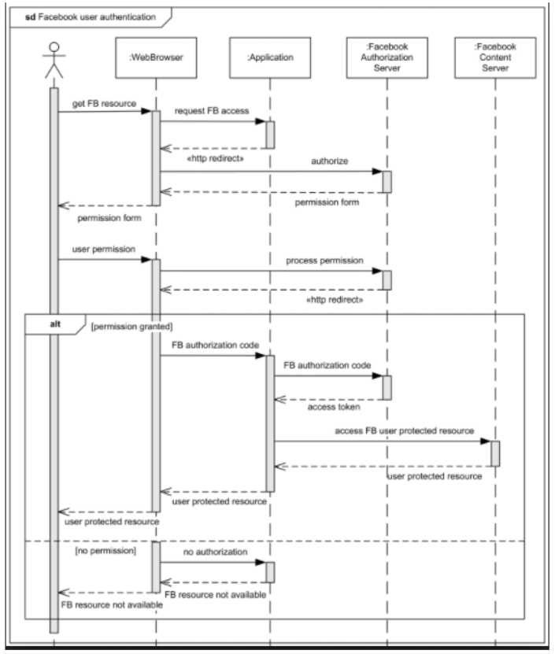

# Material 13 Lab - UML Sequence Diagram <!-- omit in toc -->

## Course

### Lab 01

找尋物件的方法可以區分成兩大類。請問是哪兩大類。

> **My Answer:**
> 
> Maximize, minimize

### lab 02

CRC Cards 的方法基本上是屬於哪一種方法?

> **My Answer:**
>
> CRC Cards 全名是 Class-Responsibility-Collaborator Cards，是一種物件導向分析方法。透過 use-cases 去分析的方法。

### Lab 03

請問在 sequence diagram 中 以下兩個箭頭有什麼不同


1. 
2. 同步用


### Lab 04


an Order, and Order Line, aProduct, aCustomer

calculate price

```cpp
calculatePrice() {

}

getPrice(quantity: number) {

}

getDiscountValue() {
    return discountValue;
}

getBaseValue()
```

### lab 05

The following is a pseudo code for 104 Job-hunting website. 

  procedure searchjob
    foreach (listedjob)
       if (listjob.getSalary() > NT$50000)
            high_level_customer.assign(listjob)
       else
            low_level_customer.assign(listjob)
    end for
    if (high_level_customer.getJobs() < 10)
        high_level_customer.changeLevel(+1);
  end procedure

Please draw the UML sequence diagram (diagram版本請至少是UML 2.0或以上)


## Take Home

### Homework - Lab 06

這個星期的影片，老師給了個例子 B.1，告訴你如何從 use case -> pseudo code -> distribute code into classes 來找 methods。老師也在影片中介紹了一些繪製 sequence diagram 的工具。


你們上次已經為你們的期末project 繪製出 class diagram。踏出了分析的第一部 。當然，你們的分析還缺了一大部分，你們今天的目的就是完成還欠缺的部分。你要繳交的內容如下  

1. class diagram with methods and key attributes
2. 每個 methods 的概略行為為何 (請參考影片)
3. UML editor 的每一個 use case 請你都用一個 sequence diagram 繪製出來。

請同學將三題的答案彙整成一個 PDF 檔繳交，檔名為{學號}_{姓名}.pdf (例：109522000_李奇丸.pdf)。

### Homework - Lab 07

請把附圖的 pseudo code 寫出來。




- [[UML]學習筆記-循序圖型(Sequence Diagrams)-8](https://terryjryeh.blogspot.com/2019/03/uml-sequence-diagrams-8.html)
