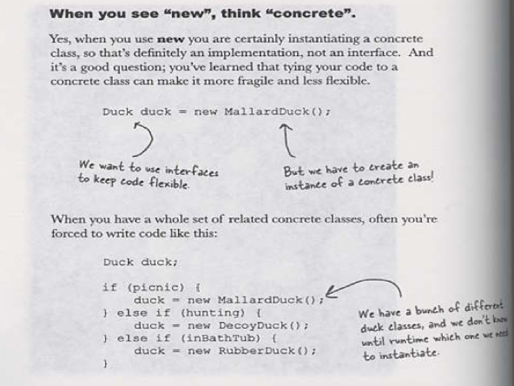
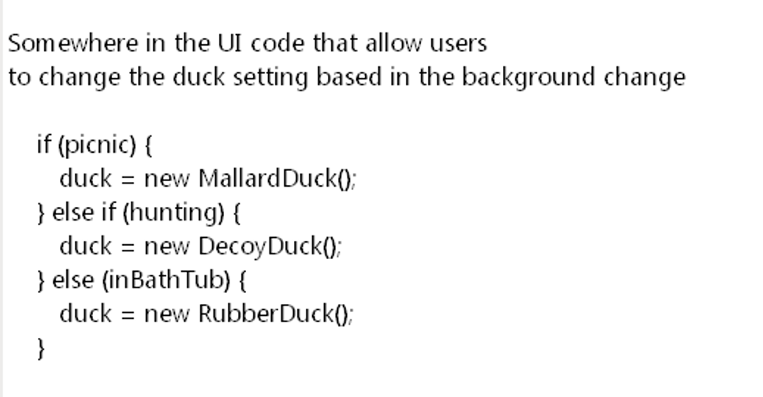
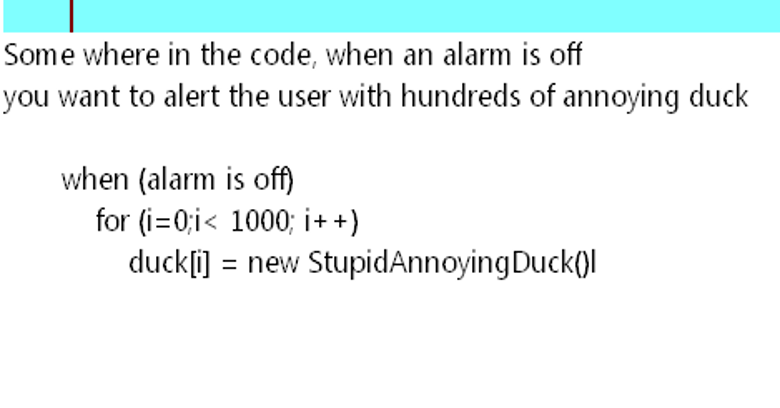
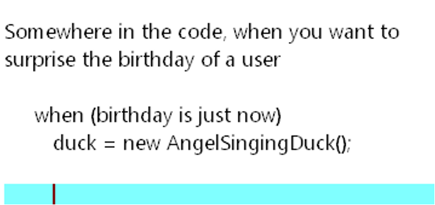

# Material 15 - Design Pattern 2 <!-- omit in toc -->

## Decorator Pattern

> [!NOTE]
> take time and costs: 確定未來有需要擴充再做

P42. `in` concrete 變數

## Factory Pattern

### Create objects

- You normally create objects with new operators
- However, new operators are not always good solution
- Its public interfaces can lead to coupling problem

> [!NOTE]
> - It will be reopened and examined when the code should be changed
> - This kind of code ends up in several parts of the application making maintenance and updates more difficult and error-prone

讓 subclass 決定哪個 class 可以抽換掉

p32. code 重看

## Model View Controller Pattern

